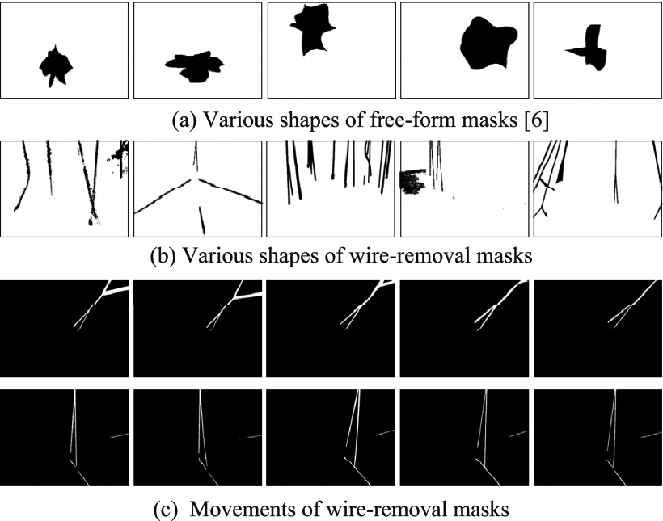

# Wire-Removal Video Dataset (WRV)

## Dataset Overview
**Wire-Removal Video Dataset (WRV)** is a specialized benchmark for video inpainting in irregular slender regions, designed for film/TV post-production scenarios. Key features include:
- 🎬 **150 video clips** curated from movies/TV series  
- 🌟 **Real-world dynamics**: Non-static foregrounds, multi-actor scenes  
- 🎭 **Natural masks**: Generated from dynamic wires/props in martial arts stunts  
- 🏆 **Industrial relevance**: Directly addresses practical wire removal needs  

## Technical Challenges
<div align=center></div>

Focuses on three critical aspects for thin irregular mask inpainting:
1. **Long-range temporal coherence** - Cross-frame consistency maintenance  
2. **High-frequency detail synthesis** - Texture reconstruction in wire regions  
3. **Multi-motion reasoning** - Trajectory prediction for dynamic objects  

## Data Samples
<div align="center">

| Raw Frame (GT) | Dynamic Mask | Professional Restoration |
|:---:|:---:|:---:|
|  |  |  |
| Original frame with wires | Slender region annotation | Expert manual restoration |

</div>

## Download
### Standard Definition (480P)
🔗 [Baidu Disk](https://pan.baidu.com/s/1aKNL7l1tr_WPkyrfxAXqxw?pwd=xc17)  
🔑 Access Code: `xc17`  

🔗 [Google Drive](https://drive.google.com/file/d/1qxRGsgI-qku8bJ13jKpbY6cJGc4fDlpu/view)

### 4K Version
🚧 Coming soon...

---

## 🚀 Extended Resources  
**For industrial-grade video inpainting research**, we strongly recommend:  

<div style="background: #f5f5f5; padding: 15px; border-radius: 8px; margin: 20px 0;">
  <h3 style="color: #2E86C1; margin-top: 0;">📈 WRV2 Dataset (Enhanced Version)</h3>
  
  🔗 <a href="https://github.com/Suyimu/WRV2" style="font-weight: bold;">GitHub Repository</a>  
  
  <div style="display: flex; gap: 15px; margin: 10px 0;">
    <div style="flex: 1;">
      ✅ <strong>4000+ video groups</strong><br>
      ✅ <strong>4K resolution support</strong><br>
      ✅ Dynamic multi-object masks
    </div>
    <div style="flex: 1;">
      ✅ Wire-shape mask generation<br>
      ✅ Pre-trained models<br>
      ✅ Richer scenarios
    </div>
  </div>

  <p style="border-left: 4px solid #2E86C1; padding-left: 10px; margin: 10px 0;">
  <em>Designed for both academic research and production pipelines, WRV2 provides the largest available training resources for professional video restoration tasks.</em>
  </p>
</div>

---


## Citation
```bibtex
@article{ji2022g2lp,
  title={G2LP-Net: Global to Local Progressive Video Inpainting Network},
  author={Ji, Zhong and Hou, Jiacheng and Su, Yimu and Pang, Yanwei and Li, Xuelong},
  journal={IEEE Trans. Circuits Syst. Video Technol.},
  volume={33},
  number={3},
  pages={1082--1092},
  year={2022},
  publisher={IEEE}
}
```
```bibtex
@misc{ji2024raformer,
   title={Raformer: Redundancy-Aware Transformer for Video Wire Inpainting}, 
   author={Zhong Ji and Yimu Su and Yan Zhang and Jiacheng Hou and Yanwei Pang and Jungong Han},
   year={2024},
   eprint={2404.15802},
   archivePrefix={arXiv},
   primaryClass={cs.CV}
}
```
## License
[](LICENSE)

---
**Maintainers**: G2LP Development Team  
**Last Updated**:  2025.02.21
**Document Version**: 2.1
---
